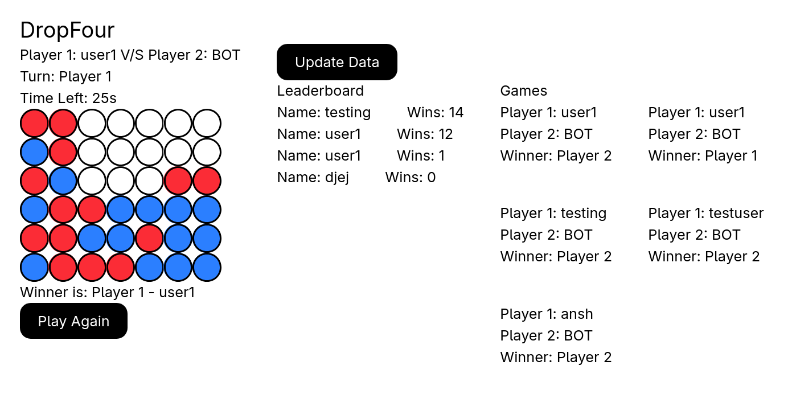

# DropFour
DropFour is a two-player strategy game where players take turns dropping tokens into a vertical grid. The objective is to be the first to connect four of your tokens horizontally, vertically, or diagonally.

https://dropfour.vercel.app/
( Note - Back-end is deployed on a free tier service. It might take a few seconds to start the server )



## Tech Stack
- Front-end - React
- Back-end - GoLang
- Database - PostgresSQL

## Functionalities
- If no other player is available (i.e after 10 sec in queue), Bot will act as second player. It is using minmax algo that will look ahead next 5 moves with all the combinations and choose the best one
- Top 10 players leaderboard and result of last 5 games played
- Can Reconnect back the active game within 30 sec

## Getting Started
Follow these instructions to set up and run the project locally.

### 1. Clone the Repository
```bash
git clone https://github.com/AnshKumar200/dropfour.git
cd dropfour
```

### 2. Run the project
#### 1. Front-end
- Install all the required packages for the project.
```bash
npm install
```

- Start front-end
```bash
npm run dev
```

#### 2. Back-end
- Backend code is in api dir.
```bash
cd api
```

- Make a .env file
- Assign DATABASE_URL to the your database url.

- Install all the required packages for the project.
```bash
go mod tidy
```

- Start back-end server
```bash
go run .
``` 
